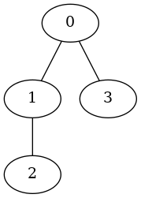
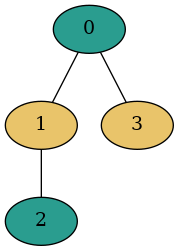

# GraphColoring
This project offers a solution to the Graph Coloring problem using 
a Genetic Algorithm. Graph Coloring tries to find the least amount of 
colors needed such that two adjacent nodes do not share the same color.
Graphs are read and written in the dot language. 

For example:

 

## The Algorithm
A random initial population is generated. A pseudo random number generator 
is used for generating these individuals. However, a quasi-random number 
generator could be used for a more uniform state space initialization.

A fitness function is required to evaluate the quality of the solution. 
For this problem, the fitness function will simply be the total number 
of different colors present in the individual.

For each generation, a list of parents must be selected for creating 
the following generation. The strategy used for this genetic algorithm 
was tournament selection, where a fixed number of individuals are selected 
and then the fittest individual is chosen as a parent for the next generation.
Tournament selection has the advantage of having a low selective pressure 
which increases the diversity in the generated individuals, 
but also results in a lower convergence rate.

Individuals are crossed to generate a new individual. The attribute to 
determine is the color for each node. In this case, the color for a child 
node will be randomly selected from one of the parents. Obviously, 
it's possible to select the same color of an adjacent node. In this case, 
the color chosen will instead come from the other parent. In the event 
this new color is also invalid, a random valid color will be chosen.

Additionally, individuals will have a chance to mutate, where a random node
will change color. Care has to be taken to make sure no adjacent node shares 
this color. 

The next generation has to be chosen from the list of individuals from
the current generation and the list newly created children. For this project,
the next generation is composed entirely of the created offspring.

Lastly, a halting criteria must be selected. When, after certain number of 
generations no better solution has been found, the current simulation will 
finish.

The basic algorithm is as follows:
1. Generate a random initial population
2. Evaluate the fitness of the current generation
3. Select parents for generating offspring
4. Cross selected parents
5. Mutate the generated offspring
6. Replace the old generation
7. Go to step 2 unless halting criteria is met

## Building
This project was developed for Linux.
The project can be compiled with the following:

    mkdir build
    cd build
    cmake  -DCMAKE_BUILD_TYPE=Release ..
    make

Boost is required for processing and generating graphs. To install using the apt package manager:
    
    sudo apt-get install libboost-all-dev

## Testing

There is a suite of tests included in the project. These can be run using the following command:
    
    ctest -j

## Execution

Compiling this project will generate a binary called GraphColoring.
Simulation parameters can be specified as command line arguments.
Arguments of interest include some of the following:

- **--help**: view available arguments.
- **--input_file**: specify location of initial graph file.
- **--population_size**: indicate the population size for each generation.
- **--tournament_size**: specify the size of tournaments for selecting individuals for mating.
- **--seed**: specify initial seed for generating random individuals.
- **--num_runs**: include the number of simulations to execute.

Once each simulation is complete, a file containing the best solution 
found for each simulation will be generated. 

These output files are written in the dot language and can be viewed by using an interpreter.
An online interpreter can be used:

    https://dreampuf.github.io/GraphvizOnline/

Alternatively, graphviz can be used to generate the image file:

    sudo apt install graphviz
    dot -Tpng best_solution_found.txt -o filename.png